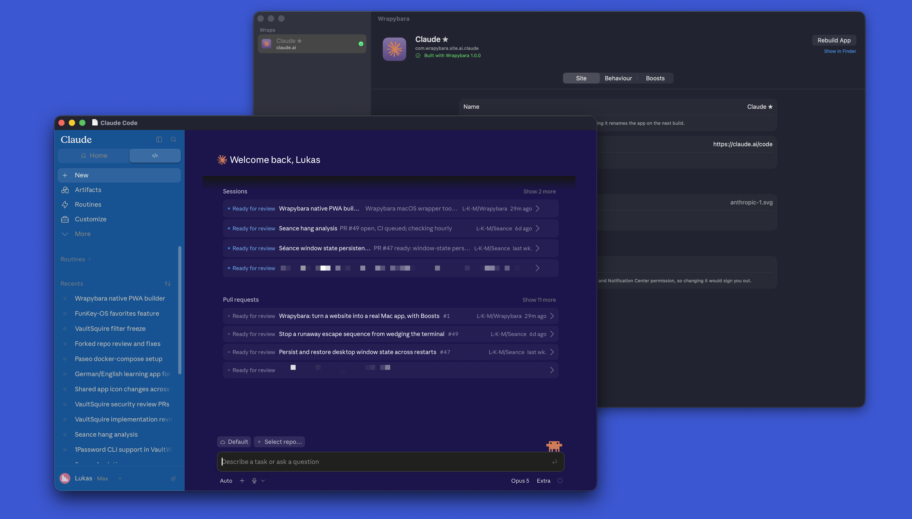

#  Wrapybara

> [!IMPORTANT]
> LLM disclosure: This codebase was written with substantial help from large language models: AI coding agents working from the [`AGENTS.md`](AGENTS.md) brief in this repo.

Turn a website into a **real Mac app** — with its own icon, menu bar, tabs and login
session — and then customise the site inside it with **Boosts**.



**Latest release:** v<!-- version -->1.1.0<!-- /version --> · [Download](https://github.com/L-K-M/Wrapybara/releases/latest)

> [!IMPORTANT]
> LLM Disclosure: Wrapybara was built with substantial help from large language models — primarily Anthropic's Claude, via Claude Code. Much of the code arrived through AI-authored commits and `claude/*` pull-request branches, with agent guidance kept in [`AGENTS.md`](AGENTS.md)

If you like this, also look at **[Zap](https://github.com/L-K-M/Zap)** (a ⌘-Tab
switcher), **[Top Drawer](https://github.com/L-K-M/TopDrawer)** (screen-edge
drawers) and **[Jetty](https://github.com/L-K-M/Jetty)** (a Dock replacement).

## What it does

Type an address. Wrapybara writes a signed `.app` into `/Applications` that opens
that site — and behaves like something a person wrote on purpose.

### A real app, not a browser window with the tabs hidden

- **A proper Mac icon.** The site's artwork is composed onto a macOS-proportioned
  rounded plate at every size including the Retina ones, so it sits in the Dock like
  the apps around it instead of like a pasted-in square. Or use the artwork as-is,
  or an image file of your own, or the generated monogram.
- **A full menu bar.** ⌘L to go to an address, ⌘F to find (WebKit's own find, so it
  highlights and scrolls like Safari), ⌘R and ⇧⌘R, ⌘0/⌘+/⌘− for zoom, ⌘[ and ⌘] for
  back and forward, ⌘P to print, Share, Services, Spelling — and a working Edit menu,
  which is what a lot of wrappers forget.
- **Native tabs.** ⌘T, the AppKit tab bar, tab overview, Merge All Windows.
- **Real downloads.** Into `~/Downloads`, with Dock progress and a Finder reveal.
  A PDF export link downloads a PDF instead of doing nothing.
- **Reopens where you left off** — page, scroll position and unsubmitted form
  text, and each window back on its own screen, at its own size, full screen if
  that's where it was quit.
- **Links go where you'd expect.** Links off the site open in your browser; login
  redirects and script navigation stay in the app, so signing in through an identity
  provider doesn't dump you into Safari halfway.
- **Its own login.** Each app gets its own bundle identifier and its own WebKit
  session, so two wraps of the same site can be two different accounts.
- **Stays live in the background.** A page the server drives — an agent writing a
  reply, a chat stream, a build log — keeps running while you work in another app
  and shows current state the moment you look again.
  The app holds macOS's "user-initiated work" assertion instead of letting App Nap
  freeze its web content, and WebKit's background timer throttling is switched off.
  The page still sees the normal hidden/visible transitions a browser gives it, so
  when you come back it catches up the way it does in Safari — including after a
  sleep that cut its connections — usually with no reload needed (that half is the
  site's own resync logic, the same one it uses in a browser tab).
- **Dock badge** read out of the page title, the way a browser tab does it.
- **Handoff** — pick the page up on your iPhone.
- **A few megabytes**, because WebKit is already on your Mac. Not a few hundred.

### Boosts — customise any site

In the spirit of [Arc's Boosts](https://resources.arc.net/hc/en-us/articles/19212718608151-Boosts-Customize-Any-Website)
and [Zen's mods](https://zen-browser.app/release-notes/), with a live preview of the
real site beside the controls:

- **Colours** — background, text, links, accent, with a visible choice about how far
  the override reaches into the page.
- **Type** — font stack, monospace font, text size, line height, case, readable
  column width. Icon fonts are left alone, so your icons don't turn into tofu.
- **Image adjustments** — brightness, contrast, saturation, hue, invert, greyscale.
  Inverting keeps photographs looking right, the way the system's Smart Invert does.
- **Zap** — click an element to hide it forever. **↑** widens the selection to its
  container, **↓** narrows it back, Esc cancels.
- **Your own CSS and JavaScript**, applied last so they always win.
- **Scoped** to everywhere, a domain, a URL prefix, a glob or a regex.
- **Shared boosts** — write "hide cookie banners" once, switch it on per app.
- **Import and export** as `.wrapyboost` files.

Edits apply to a **running** app. Drag a slider and the app in front of you
restyles — no rebuild, no relaunch.

> [!NOTE]
> Restyling an arbitrary site from the outside is inherently heuristic — it's a
> stylesheet with `!important` on it, not engine-level colour work. Wrapybara tries
> to be honest about that rather than hide it: the aggressive options say what they
> will break, next to the switch.

## Requirements

- macOS 13 (Ventura) or newer.
- **Xcode Command Line Tools**, for `/usr/bin/codesign`. Every app Wrapybara builds
  must be signed — macOS won't run an unsigned app on Apple Silicon — and signing is
  the one thing with no public API. If they're missing, Wrapybara says so and offers
  to run `xcode-select --install`.

Ad-hoc signing is the default and needs no Apple Developer account. If you have a
Developer ID, pick it in Settings and the apps you build won't trip Gatekeeper at
all.

## Install

Download the [latest release](https://github.com/L-K-M/Wrapybara/releases/latest)
and drag `Wrapybara.app` to `/Applications`.

Releases are **not** notarized, so Gatekeeper warns on first launch:
right-click → **Open** → **Open**, or

```sh
xattr -dr com.apple.quarantine /Applications/Wrapybara.app
```

## Export an Android APK

The Mac builder can also export standalone apps for **Android 8 or later**. Each
APK has its own icon, package identifier and login storage, using Android's WebView.

Install **JDK 17 or later** and the [Android command-line tools](https://developer.android.com/tools/sdkmanager).
Install the required SDK packages and accept their licences:

```sh
~/Library/Android/sdk/cmdline-tools/latest/bin/sdkmanager \
  "platforms;android-35" "build-tools;35.0.0"
```

Select a wrap and choose **Export Android APK…**. Set your SDK folder; leave JDK
home blank for automatic discovery, or select the JDK's `Contents/Home` folder.
Choose **Export APK…**, save it, then transfer it to your device. Android may ask
you to allow installation from the app opening the APK. Wrapybara downloads no
build tools and needs neither Android Studio nor Gradle.

Keep the same wrap when exporting updates. Back up
`~/Library/Application Support/Wrapybara/`, including **AndroidSigning** (keys) and
**AndroidExports** (update versions). Each key's password is kept in your login
Keychain, not in that folder, so keep your Keychain too; Time Machine and Migration
Assistant carry both. Losing a signing key or its password prevents updates to its
installed apps. Renaming a wrap preserves its Android identity.

Android has a smaller feature set:

- Boosts apply to the main page after loading. Before-page scripts are skipped;
  regex scopes use JavaScript syntax, which can differ from Mac matching.
- Rebuild and reinstall to apply edits. There is no live sync with the Mac.
- Some sign-ins reject WebViews. Android may suspend background updates.
- New-tab links use the current view. Mac window, tab and user-agent settings do
  not apply; Mac menus, Handoff and Dock integration are unavailable.
- Downloads open in your browser and may require signing in again. File uploads,
  camera, microphone and website notifications are not supported.

## Build from source

Requires **Xcode 16+**. No dependencies.

```sh
xcodebuild -project Wrapybara.xcodeproj -scheme Wrapybara -configuration Debug build
xcodebuild -project Wrapybara.xcodeproj -scheme Wrapybara -destination 'platform=macOS' test
```

Or `scripts/build.sh` (see [`CICD.md`](CICD.md)). The app icon is built from
`media-sources/icon.png` — `python3 Tools/make-appicon.py` masks it to the macOS
squircle on Apple's 824/1024 grid and rewrites the ten `AppIcon.appiconset` slots
plus `docs/icon.png`.

## How it works

One Mac binary, two lives. `Wrapybara.app/Contents/MacOS/Wrapybara` is copied byte for
byte into each Mac app it builds; the copy reads a `WBWrapIdentifier` key out of its own
`Info.plist` and runs as a site app instead of the builder. So a generated app holds
no reference back to Wrapybara — **deleting Wrapybara doesn't break the apps it
built.**

Each Mac app carries a baked-in copy of its configuration and also watches a shared
directory for the live one, taking whichever is newer. That's what makes editing a
boost show up in a running app.

Android export compiles a separate Java runtime with your local SDK and JDK,
packages its configuration and Boosts, then signs and verifies the APK. The APK
needs neither Wrapybara nor a connection to your Mac.

[`PLAN.md`](PLAN.md) has the full design, including why WebKit rather than Chromium,
Gecko or Servo — and what would have to change for a Servo backend to make sense.

## Why "Wrapybara"

It wraps things, and a capybara is unbothered by anything.
